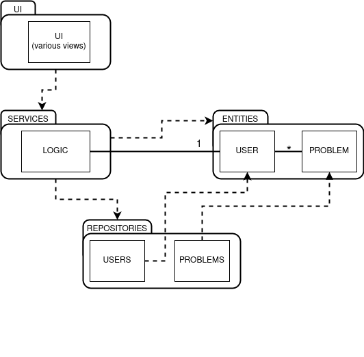

# Arkkitehtuurikuvaus

## Ohjelman rakenne

Ohjelma rakentuu kerroksista joista jokaisella on oma tehtävänsä. Ohjelman pakkausrakenne tehtävinään on seuraava:
- UI vastaa kaikesta käyttöliittymään liittyvästä.
- entities sisältää user ja problem olennot jotka kuvastavat käyttäjää ja kiipeilyreittiä
- reposotories on vastuussa kaikesta kommunikaatiosta ohjelman tietokannan kanssa
- services sisältää varsinaisen sovelluslogiikan. Kaikki kommunikaatio käyttöliittymän ja muiden ohjelman osien kanssa tapahtuu tätä kautta.

Ohjelman luokka/pakkausrakenne vastaa karkealla tasolla seuraavaa kuvaa.

## Näkymät

Ohjelmassa on useita erilaisia näkymiä. Ohjelman käynnistyessä aukeaa kirjautumisnäkymä, josta voi joko kirjautua sisään antamalla validin käyttäjänimen ja salasanan, tai siirtyä toiseen näkymään luomaan uuden käyttäjän. Ennen kuin uuden käyttäjän luominen onnistuu, tarkistaa ohjelma että samaa käyttäjänimeä ei ole vielä toisella käyttäjällä
Uuden käyttäjän luomisen tai onistuneen sisäänkirjautumisen jälkeen aukeaa päänäkymä johon on listattu kaikki kyseisen käyttäjän itselleen tagaamat reitit. Ensimmäisellä käynnistyksellä tässä ei luonnolliseti näy mitään. Reitit on oletus arvoisesti järjestetty nimen mukaiseen aakkosjärjestykseen kiipeämättömät ensin. Järjestystä voi muuttaa valitsemalla järjestysperusteen valikosta ja painamalla valikon vieressä olevaa nappia. Mikäli samaa nappia painelee useamman kerran muuttaa se järjestystä nousevan ja laskevan välillä. Reitin tietojen vieressä on nappi jota painamalla voi reitin merkitä kiivetyksi tai poistaa merkinnän. Tieto tästä tallentuu tietokantaan, uxp tauluun, joka pitää kirjaa käyttäjän itselleen lisäämistä reiteistä.
Uuden reitin lisääminen tapahtuu omassa näkymässään johon siirrytään päänäkymästä löytyvää nappia painamalla. Näkymässä on joukko tekstikenttiä joihin syötetään uuden reitin tiedot. Tiedot tallenetaan tietokantan ja niiden muotoilua ei varsinaisesti vahdita mitenkään. Ohjelma ainoastaaan tarkistaa että saman nimistä reittiä ei vielä löydy tietokannasta.
Päänäkymästä pääsee myös siirtymään näkymään jossa voi tarkastella kaikkien käyttäjien ohjelmaan lisäämiä reittejä, tässä näkymässä toimivat samat järjestys toiminnnot kuin päänäkymässäkin. Reitin tietojen vieressä on tässä näkymässä nappi josta painamalla reitin voi tagata itsellensä, tai poistaa tagin. Nappia painamalla reitti ja ohjelman sen hetkinen käyttäjä lisätään uxp tietokantaan, mikäli reitti on jo kertaalleen tagattu, painaminen poistaa vastaaavan rivin tietokannasta. Samassa tietokannassa säilytetään myös tietoa onko käyttäjä merkinnyt reitin kiivetyksi, mikäli tagaus poistetaan, myös tämä tieto katoaa.
Tagatut reitit näkyvät päänäkymässä käyttäjän palatessa sinne seuraavan kerran. Päänäkymästä pääsee palaamaan kirjautumisnäkymään painamalla log out nappia.

## Solvelluslogiikka

Käyttäjää ja reittiä kuvaavat olennot, user ja problem. Näiden käsittelystä vastaavat luokat Users ja Problems, jotka muiden luokkien sitä pyytäessä, hakevat tietokannoista tietoa tai tallettavat sitä tietokantaan. Kaikki tälläiset pyynnöt kulkevat sovelluslogiikastasta vastaavan Logic luokan kautta.
Logic luokka myös tallentaa tiedon siitä kuka käyttäjä on kirjautunut sisään. Käyttöliittymä ja näkymien luominen on eriytetty omiin luokkiins, UI paketin sisälle. 

## Tiedon tallennus

Repositories pakkauksen luokat Users ja Problems ovat yhteydessä SQLite tietokantaan. Tietokannassa on kolme taulua, users, problems ja uxp kaksi ensiksi mainittua lienevät tehtävältään selkeitä. Uxp taulu on yhdistää käyttäjiä ja ongelmia.
Sinne tallennetaan riville: käyttäjän ID, reitin ID sekä tieto siitä onko käyttäjä merkinnyt reitin kiivetyksi (numeroin 1, tai 0). Tästä taulusta saadaan tieto siitä että mitkä reitit näyteään päänäkymässä käyttäjälle.
Tietokantataulun nimi ja polku määritellään konfiguraatiotiedostossa joka löytyy projektin juurihakemistosta config.py. TIetokannat alustetaan ajamalla init_db.py tiedosto, komennolla ` poetry run invoke initdb `.
Tämä tulee tehdä ennen ensimmäistä käynnistystä sillä se luo tarvittavat tietokannat. Saman komennon uudelleen ajaminen, tyhjentää kaikki tallennetut tiedot tietokannoista. Muuta keinoa yskittäisen käyttäjän tai reitin poistamiseen ohjelma ei tällä hetkellä tarjoa.

## Sovelluksen toiminta
Sovelluksen toimintaa on kuvattu jo monin paikoin aikaisemmin tekstissä. Esimerkin vuoksi kuitenkin käykäämme läpi tarkemmin mitä tapahtuu kun käyttäjä luo uuden reitin. 
Alkuasetelmassa sisäänkirjautunut käyttäjä on täyttänyt new problem näkymän kentät ja painaa Create nappulaa. Nappulan toiminnasta vastaava _new_problem_button_fuct metodi noutaa tekstikenttien tiedot ja välittää ne logic luokan metodille new_problem.
new_problem metodi täydentää tietoja lisäämällä reitin luojaksi nykyisen käyttäjän, joka on tallennettu oliomuuttujaan current user. Sen jälkeen metodi välittää problems luokan metodille add_problem problem olion joka luodaan metodikutsun yhteydessä. Problem olion parametreina käytetään edellisissä kohdissa kerättyjä tietoja.
Problems luokan add.problem metodi, purkaa tiedot tietokannan ymmärtämään muotoon, tarkistaa ettei saman nimistä ongelmaa ole jo olemassa ja muodostaa tietokantayhteyden, jonka kautta tiedot kirjoitetaan tietokantaan, problems tauluun. Sen jälkeen metodi välittää vielä tiedot reitistä ja käyttäjästä saman luokan add_to_uxp metodille.
Add_to_uxp metodi viimeistelee reitin lisäämisen lisäämällä sen ja tiedon käyttäjästä uxp tietokantaan. Tietokantaan lisätään myös numero 0 tiedoksi siitä että reittiä ei ole vielä merkitty kiivetyksi. Uxp tietokantaan lisäämisen jälkeen reitti näkyy käyttäjän päänäkymässä, ellei sitä poisteta tietokannasta.
Ohjelman tämän hetkisessä versiossa ei käyttäjälle palaudu mitään tietoa siitä onko reitti lisätty onnistuneesti vai ei. Tämä toiminnallisuus toteutunee ennen loppupalautusta.
 
