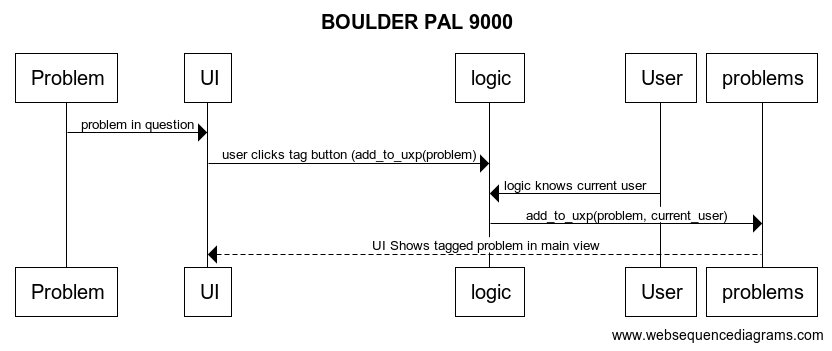

# Arkkitehtuurikuvaus

## Luokka-/pakkauskaavio
Ohjelman rakenne kuvattuna karkealla tasolla. UI-pakkaus sisältää käyttöliittymän,
Services sovelluslogiikan, Entities käyttäjä ja ongelma olioita kuvaavat luokat, ja repositories ohjelman käyttämien tietokantojen käsittelyn.

## Sekvenssikaavio
Esimerkki ohjelman toiminnasta. Aluksi sisäänkirjautunut käyttäjä on näkymässä jossa näkyvät kaikki lisätyt reitit ja painaa "tagaus" nappia nostaakseen reitin omaan päänäkymäänsä.
Sovelluslogiikka tuntee jo sisäänkirjautuneen käyttäjän, reitin jota nappi koskee. UI kuvaa kaaviossa laajemmin kaikkia käyttöliittymästä vastaavia luokkia.
Problems luokka huolehtii kesksustelusta tietokannan kanssa. Uxp tietokanta on yhdistelmätietokanta joka kerää yhteen käyttäjiä ja reittejä.
Kaavio oikaisee hieman mutkia. Oikeasti ohjelma hakee myös tietoa käyttäjästä, käyttäjien tallentemisesta vastaavasta tietokannasta (ID:n), lisätessään käyttäjän ja reitin uxp tietokantaan.

