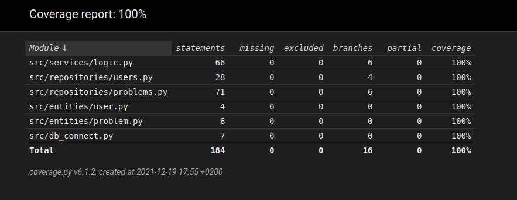

# Testaus

Ohjelmaa on testattu sekä automatisoiduin testein että manuaalisesti suoritetulla jatkuvalla testausksella ohjelmoinnin lomassa. Ohjelman graafinen käyttöliittymä on jätetty testauksen ulkopuolelle ja sen toiminnan standardiksi on valittu "riittävän hyvä".
Toisin sanoen, graafista käyttöliittymää ei pitäisi saada kokonaan rikki muuttamatta ohjelman koodia, mutta pieniä kauneusvirheitä saattaa syntyä. 

## Testauksen yksityiskohtaisempi kuvaus

Testauksessa käytetään erillistä tietokantaa joka tyhjennetään aina uuden testin alkaessa. Testiluokkia on kolme, Logic_test testaa varsinaista sovelluslogiikkaa, user_test käyttäjiin liittyviä ominaisuuksia ja problem_test reitteihin liittyvää toimintaa.
Kun testauksessa tarvitaan olioita varsinaisesti testattavan luokan ulkopuolelta, niitä luodaan ja lisätään testitietokantaan tarpeen mukaan. Koska tietokanta tyhjennetään jokaisen testin alkaessa, voidaan olla varmoja, että aikaisemmissa testeissä luodut oliot eivät häiritse nykyistä testiä. 
Tietokannan luominen ja tyhjentäminen testataan Logic_test luokassa. Coverage testiraportin ulkopuolelle on jätetty ohjelman UI kerros, sekä tiedostot init_db.py ja config.py. Mikäli kaksi mainittua tiedostoa lisätään raportille voidaan huomata että testit eivät kata tilannetta jossa tietokannan polun hakeminen, ennen sen luomista epäonnistuu, eivätkä tilannetta jossa init_db.py käynnistetään suoraan komentoriviltä.

Ohjelman toimintaa on ohjelmoijan toimesta testattu manuaalisesti vain cubbli linux käyttöjärjestelmällä. Testausta on suoritettu sekä ohjelmointiin käytetyllä tietokoneella että virtuaalityöaseman kautta laitoksen koneilla.
Ikävä kyllä ohjelmoijan rajoittunut laitekanta ei mahdollistanut laajempaa testipohjaa.

Ohjelman manuaalitestauksessa on pyritty ottamaan huomioon mahdolliset tavat väärinkäyttää ohjelmaa sekä syöttämällä epäkelpoja syötteitä, että esimerkiksi lataamalla viallinen kuva. Viallista tietokantaa ei ole erikseen testattu.
Ohjelma osaa varautua myös puuttuvaan tai virheelliseen tietokantaan ja antaa virheilmoituksen käyttäjän yrittäessä kirjautua sisään. Tätä ei kuitenkaan spesifisti testata automaattitesteissä.

Ohjelman coverage raportin haaraumakattavuus on 100%, testien ollessa ohjelman toiminnan kannalta oleellisia. Mikäli mukaan otettaisiin init_db.py ja config.py kattavuus laskisi muutaman prosentin.
Pylintin antama pisteytys koodin formatoinnista on 10.00/10

  
